# 選品 SOP

從 iChannels 的合作品牌裡，找出月奈要研究的產品，先以「實驗中」公開、邊用邊記，用完下結論，再根據成效調整。

**這份文件不寫現況數字。** 候選排名、曝光、點擊每天都在變，要看就跑指令。

## 誰做什麼

| 角色 | 負責 |
|---|---|
| Claude | 匯出品牌清單、跑候選排名、研究官網、建產品頁與開始前的筆記、整理月奈口述的觀察、拉 GSC／GA 報表 |
| 月奈 | 從候選裡挑、實際使用並提供觀察、拍影音、決定公開與下結論、調整站上定位（分類權重） |

入選一定要經過人：分數只反映「佣金條件＋站上定位＋需求訊號」，不代表產品好不好用。

**網站是用來解決讀者的問題，選品從問題出發，不從佣金出發。** 先問「這個產品替讀者解決什麼問題」，再看那個問題頁（指南或需求頁）有沒有：沒有就先寫問題頁，產品是問題頁裡的一個選項。佣金排名只用來在同一個問題的候選商品裡篩選。

**一個問題寫成一個系列，先規劃再動手。** 例：「臉上的斑」系列＝總覽指南（斑的種類、偏方）→ 各種斑的指南（肝斑、曬斑與老人斑、痘疤）→ 成分指南（傳明酸、熊果素）→ 品類頁＋比較頁 → 產品頁與實驗筆記。讀者怎麼問，用 Google 搜尋建議字查（`https://suggestqueries.google.com/complete/search?client=firefox&hl=zh-TW&gl=tw&q=關鍵字`），把問題分類後每類對到一頁。醫療相關的內容只引醫院衛教、政府公告與文獻，醫療處置只寫「這種情況看皮膚科」與公開衛教內容，不推薦療程。

## 流程

```mermaid
flowchart LR
  A["1 匯出品牌清單<br/>每月"] --> B["2 pnpm picks<br/>候選排名"]
  B --> C["3 人工篩選<br/>檢查表"]
  C --> D["4 研究官網<br/>建實驗中產品頁"]
  D --> E["5 邊用邊記<br/>拍影音"]
  E --> F["6 下結論"]
  F --> G["7 追蹤成效<br/>pnpm seo"]
  G --> H["8 每月檢討<br/>調權重與關鍵字"]
  H --> B

  style A fill:#e8f0fc,stroke:#2a6bb8,stroke-width:2px,color:#1e2030
  style B fill:#e8f0fc,stroke:#2a6bb8,stroke-width:2px,color:#1e2030
  style D fill:#e8f0fc,stroke:#2a6bb8,stroke-width:2px,color:#1e2030
  style G fill:#e8f0fc,stroke:#2a6bb8,stroke-width:2px,color:#1e2030
  style C fill:#fcf5e8,stroke:#8a7020,stroke-width:2px,color:#1e2030
  style E fill:#fcf5e8,stroke:#8a7020,stroke-width:2px,color:#1e2030
  style H fill:#fcf5e8,stroke:#8a7020,stroke-width:2px,color:#1e2030
  style F fill:#ecedf0,stroke:#1e8050,stroke-width:2px,color:#1e2030
  linkStyle default stroke:#8a8c98,stroke-width:2px
```



藍色是 Claude 做，黃色要月奈判斷，灰色是下結論。

## 三個階段

評分公式一樣，差在需求訊號有沒有數據。

| 階段 | 何時 | 候選排名靠什麼 |
|---|---|---|
| 冷啟動 | 上線後到 GSC 開始出現查詢字詞（通常 2–4 週） | 品牌條件（佣金、EPC、Cookie、免審核）× 站上定位 |
| 數據期 | GSC 有查詢字詞、GA 有內容頁瀏覽 | 上面再乘需求加成：搜尋與閱讀最多的分類最多 ×1.5 |
| 成熟期 | 有 iChannels 訂單之後 | 再加上實際訂單與獎金（`pnpm orders`） |

## 步驟

### 1. 匯出品牌清單（每月一次）

跟 Claude 說「更新 iChannels 品牌清單」。Claude 用已登入的 Chrome 讀會員後台「搜尋品牌」，逐一分類標註後存成：

```
data/private/ichannels-brands-YYYYMMDD.psv
```

`data/private/` 不進版控：佣金條件是會員限定資料，repo 是公開的。

### 2. 跑候選排名

```
pnpm picks              # 前 30 名＋各分類前 5 名，同時寫到 data/private/picks-YYYYMMDD.md
pnpm picks --top 50
pnpm picks --offline    # 沒有 gcloud 權限時，跳過 GSC／GA
```

分數怎麼算（`scripts/pick-candidates.mjs`）：

```
分數 = 分類權重 ×（佣金 45% ＋ 30天EPC 25% ＋ Cookie 20% ＋ 免審核 10%）× 需求加成
```

- **佣金**：CPS 取最高的 %，20% 算滿分；名單型（CPL／CPA）用固定金額，500 元算滿分。
- **30 天 EPC**：iChannels 全平台每次點擊平均獎金，代表「真的有人買」，取對數避免單一品牌壓過全部。
- **Cookie**：30 天算滿分。1 天以下會標「Cookie≤1天」：讀者當天沒買就不算。
- **分類權重**：站上定位，是編輯判斷不是數據，寫在腳本最上面的 `FIT`。權重 0 的分類不列入：金融理財（多是借貸名單，和「嚴選」的信任定位衝突）、購物商城（平台不是產品）、其他類別。
- **需求加成**：GSC 查詢字詞依 `QUERY_HINTS` 歸到分類，GA 內容頁瀏覽依 `PAGE_HINTS` 歸到分類。沒數據時全部 ×1。

「注意」欄的標記：

| 標記 | 意思 | 怎麼處理 |
|---|---|---|
| 要先申請 | 後台狀態是「申請」，還不能推廣 | 到後台送申請，核准前不建頁 |
| 舊品牌先確認營運 | 編號小、EPC 為 0，多是早期 Mymall 店家 | 先打開官網確認還在賣 |
| 服務型 | 沙龍、課程、訂閱、寬頻等 | 很難寫成產品知識頁，除非月奈實際體驗過 |
| Cookie≤1天 | 追蹤期很短 | 只適合「看完就會買」的低價商品 |
| 固定金額（名單型） | 按名單或註冊付費，不是按銷售 | 確認和嚴選定位相符再做 |
| 加碼中 | 目前有佣金加碼 | 加碼有期限，不要當成選它的主要理由 |

### 3. 人工篩選（月奈）

從候選裡挑 1–3 個，每個都要過這張檢查表。有一項答不出來就換下一個。

- [ ] 說得出它替讀者解決什麼問題，而且站上有（或這次會寫）那個問題的指南或需求頁
- [ ] 官網還在營運，有具體商品頁可以連
- [ ] 月奈願意實際使用（或已經用過），願意把過程按日期記下來
- [ ] 寫得出至少一項缺點、一種「不適合的人」
- [ ] 跟站上現有的品類或需求頁接得起來，或值得開新品類
- [ ] 官網的功效宣稱不會讓我們踩線（化粧品、保健食品的誇大宣稱只能引述，標「品牌宣稱」）

### 4. 研究官網、建「實驗中」的產品頁（Claude）

跟 Claude 說「幫我建 ○○ 的產品頁，官網是 …」。網站是月奈的研究筆記，產品在開始用之前就公開：

- `src/content/products/<slug>.md`，`status: published`、`stage: testing`。月奈想先看過再公開，就先不填 `status`（預設 draft，只能用直接網址打開）
- `experiment`：`question`（這次想驗證什麼，一句話）、`watch`（要觀察的事）、`startedAt`（第一天開始用的日期，還沒開始就不填）
- `log`：實驗筆記，一筆一個日期。Claude 先寫開始前的功課（`kind: prep`）：成分表讀到什麼、官網宣稱怎麼測的、有什麼要先問清楚的。使用中的觀察只能來自月奈，Claude 不代寫
- 開始前的功課也包含網路資料：購物網站評價、@cosme、Dcard、PTT、部落格心得、成分的研究文獻與食藥署規定。每則筆記的資料放 `refs`（頁面顯示成「資料：」連結），也列進產品的 `sources`。只看得到摘要、打不開原頁的要寫明；合作文、舊版產品的討論要標出來，不能當成獨立心得
- 實驗中可以先不寫 `pros`；`fitFor`、`notFitFor`、`cons` 只寫官網寫明的用途與限制，頁面會標成「官網說適合」「開始前就知道的限制」
- 結構化資料不輸出 Review，llms.txt 會標「實驗中，尚未下結論」
- 品牌不在站上：新增 `src/content/brands/<id>.md`，填 `affiliate`（iChannels 品牌編號、佣金條件、查閱日期），購買按鈕就會自動換成推廣連結
- 價格一定帶查閱日期與官網連結；組合內容逐項列清楚
- 有兩個以上同類產品，順便做比較頁與「我適合哪一組」
- **要拿競品來比較時，不替競品建產品頁**：寫在比較頁的 `externals`（名稱、品牌、官方資料來源），只在比較表出現、沒有購買連結。功效一律標「品牌宣稱」，使用體驗留「待實測」
- **缺點可以標性質**（選填）：`cons` 每項可寫成 `{ text: …, kind: … }`，產品頁會在前面貼標籤。來源沒講清楚是哪一種就寫純字串，不要猜

  | `kind` | 標籤 | 例子 |
  |---|---|---|
  | `no-effect` | 沒解決問題 | 用了一個月沒感覺、保濕撐不到下午 |
  | `side-effect` | 帶來新問題 | 泛紅、刺痛、爆痘、變乾 |
  | `purchase` | 購買與服務 | 出貨慢、包裝破損、效期短、客服難找 |

### 參考資料：Amazon 評論分析報告

[ecommerce.weiqi.kids](https://ecommerce.weiqi.kids/Narrator/recommendations/)（repo `weiqi-kids/agent.ecommerce-product-review`）是 Amazon 評論的自動分析報告，分推薦、比較、警告、痛點、假貨五類。保養品類很多（CeraVe、medicube、理膚寶水、The Ordinary、朝鮮美女…），這些在台灣也買得到，可以這樣用：

- **比較頁的 `externals`**：做比較頁時，先到報告裡找同品類「評論實證有效」的產品（推薦報告的主角，或比較報告裡改善率高、不良反應低的），查到台灣通路與售價後放進比較表，再加一列「Amazon 評論（站外資料，非本站實測）」。警告報告裡的產品不放。報告頁可以列進 `sources`，但報告裡的評論比例（「14% 有不良反應」）要寫成「Amazon 評論 N 則中…」，不能寫成本站實測
- **缺點與不適合誰**：報告的負評三分類可以直接對應上面的 `kind`
- **警告、假貨報告**：寫指南時提醒讀者（例如防曬的假貨辨識）

報告開頭掛 `[REVIEW_NEEDED]`（評論數不足）的，只能當線索，不能當 `sources`。報告是分析結果不是原始出處，成分機制、統計數字要回頭找原始文獻再引用。

### 指南怎麼寫（`guides`）

痛點型、選品型的指南照這個骨架寫，借自上面那套報告的 problem_solver 格式。每段開頭先用一兩句直接回答，再展開：

1. **問題是什麼**：讀者遇到什麼狀況，多常見
2. **為什麼會這樣**：成因、機制。引用原始資料，不用「研究顯示」帶過
3. **有哪些解法**：一張表，欄位是「解法類型｜原理｜代表產品｜適合誰」。代表產品是站上的就連產品頁，不是就只寫名字
4. **怎麼選**：依膚質、預算、情境分流，「如果你是 A → 選 X」
5. **不適合誰、要注意什麼**：副作用、常見誤用、假貨風險
6. **月奈怎麼看**：實測心得；還沒實測就寫「待實測」，不要用評論代替

`kind` 選「使用者痛點」或「選品指南」，`answer` 寫第 1 到 4 段的一句話總結。

### 5. 邊用邊記、拍影音（月奈）

- 開始用的那天填 `experiment.startedAt`，之後的筆記會自動標「第 N 天」
- 每次有觀察就加一筆 `log`（`kind: observe`）：日期、標題、看到什麼。可以直接講給 Claude 聽，由 Claude 整理成一筆
- 影片、Reels 的網址填進產品的 `media`，產品頁會自動顯示，影音頁也會彙整
- 影片說明欄放產品頁網址，讓社群流量回到站上

### 6. 下結論

用完之後加一筆 `log`（`kind: result`），把 `stage` 改成 `concluded`，改寫 `verdict`（一句話結論），補齊 `fitFor`、`notFitFor`、`pros`、`cons`（schema 擋著，少一項建置就失敗），更新紀錄加一筆「下結論」。
新頁第一次公開、下結論，都是推到 `main` 自動部署，之後跑 `pnpm seo submit` 重新提交 sitemap。

### 7. 追蹤成效

```
pnpm seo index     # 收錄：新頁有沒有被 Google 收進去
pnpm seo traffic   # 曝光、點擊、查詢字詞、GA 流量來源
pnpm seo clicks    # 各產品購買按鈕被點了幾次（GA 事件 buy_click）
pnpm seo audience  # 讀者年齡、性別、興趣、裝置（Google 信號 2026-09-29 開啟）
```

```
pnpm orders        # 近 30 天 iChannels 訂單，按品牌與獎金狀態彙總（--days 90 看更久）
pnpm orders brands # 已加入推廣的品牌與佣金條件
```

### 8. 每月檢討（月奈＋Claude）

跑一次 `pnpm seo traffic`、`pnpm seo clicks`、`pnpm seo audience`，對照下面四件事：

| 看到什麼 | 怎麼調 |
|---|---|
| 某分類的查詢字詞多，但站上產品少 | 那一類優先補產品；查詢字詞沒被歸類就補進 `QUERY_HINTS` |
| 某產品頁曝光多、購買點擊少 | 檢查一句話結論和價格是否吸引人，考慮做比較頁 |
| 某產品頁 60 天沒有曝光也沒有點擊 | 不刪頁（網址永久不變），但不再投入影音資源 |
| 讀者的年齡、性別、興趣跟現有品類對不上 | 調 `FIT` 權重，往讀者興趣的分類挪 |

調整 `FIT` 權重時，在下面的修訂紀錄記一筆原因。

## 修訂紀錄

- 2026-09-29：初版。分類權重為初始設定，美妝保養最高（站上第一個品類），月奈確認沿用。
- 2026-09-29：GA 開啟 Google 信號，每月檢討加看讀者輪廓（`pnpm seo audience`）。
- 2026-10-01：取得 iChannels Web API 金鑰，`pnpm orders` 可查訂單與獎金。
- 2026-10-01：競品只放比較頁 `externals`，不建產品頁；草稿不出現在正式站列表頁。
- 2026-10-01：缺點可標性質（`cons[].kind`）；加入 Amazon 評論報告的用法與指南骨架。
- 2026-10-03：選品從讀者的問題出發；「臉上的斑」系列七頁上線（總覽、肝斑、曬斑與老人斑、痘疤、傳明酸、熊果素、淡斑精華比較）。
- 2026-10-03：網站改成月奈的研究筆記：產品以「實驗中」（`stage: testing`）公開，附實驗筆記（`log`），用完才下結論（`stage: concluded`）。
